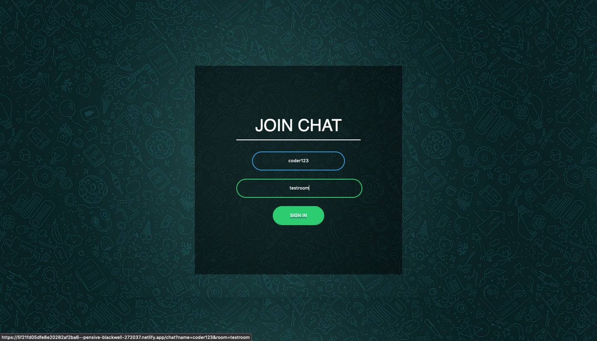
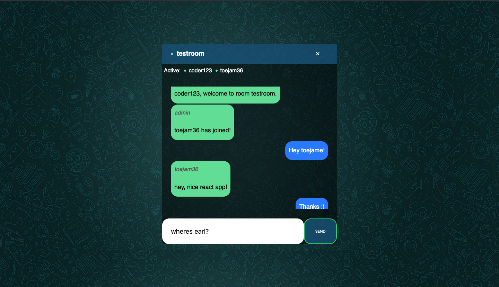

# React Chat Application

##### [*OVERVIEW*](#Overview) | [*HOW TO USE*](#How-to-use) 
___

A real time-time chat application using Socket.io, Node and React. 




___

## Overview

A real time chat application tha uses React on the front end, with NodeJS and Socket.io web socket on the backend.

The server is deployed on Heroku, and the front end on Netlify.

___

## How to use

You can use the application by licking on this <a href="https://5f21fd05dfe8e20282af2ba6--pensive-blackwell-272037.netlify.app/">link</a>.

Or if you would like to the application use locally, clone this repo, and run ```npm i && npm start``` for both client and server side to start the development server.
